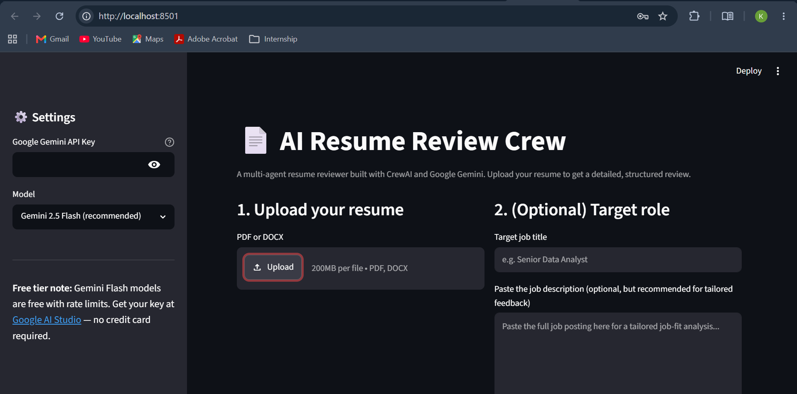
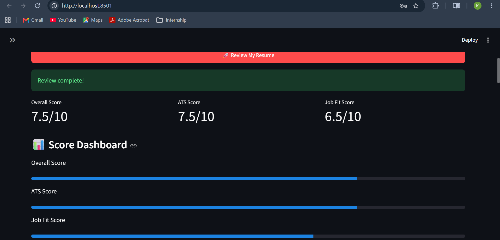

# 📄 AI Resume Review Crew

An AI-powered resume review system built using **CrewAI**, **Google Gemini**, and **Streamlit**.

The application analyzes resumes using multiple AI agents, provides ATS optimization suggestions, evaluates job fit, and generates downloadable reports.

---

## ✨ Features

* 🤖 Multi-Agent AI Resume Analysis
* 📄 PDF & DOCX Resume Support
* 🎯 Job Description Matching
* 📊 Resume Score Dashboard

  * Overall Score
  * ATS Score
  * Job Fit Score
* 📈 Visual Progress Indicators
* 📥 Download Reports as:

  * Markdown (.md)
  * PDF (.pdf)
* 🌐 Simple Streamlit Web Interface

---

## 🧠 AI Agents

| Agent                             | Responsibility                        |
| --------------------------------- | ------------------------------------- |
| Resume Content Analyst            | Reviews content quality and structure |
| ATS Optimization Specialist       | Evaluates ATS compatibility           |
| Career Coach & Job-Fit Strategist | Analyzes job-role alignment           |
| Lead Report Compiler              | Creates the final review report       |

---

## 🛠️ Tech Stack

* Python
* CrewAI
* Google Gemini API
* Streamlit
* ReportLab
* PyPDF
* python-docx

---

## 📂 Project Structure

```text
resume-review-crew/
│
├── app.py
├── requirements.txt
├── README.md
│
├── crew/
│   ├── agents.py
│   ├── tasks.py
│   └── resume_crew.py
│
└── utils/
    └── file_parser.py
```

---

## 🚀 Installation

### Clone Repository

```bash
git clone https://github.com/yourusername/resume-review-crew.git

cd resume-review-crew
```

### Create Virtual Environment

```bash
python -m venv venv
```

### Activate Environment

Windows:

```bash
venv\Scripts\activate
```

Linux/Mac:

```bash
source venv/bin/activate
```

### Install Dependencies

```bash
pip install -r requirements.txt
```

---

## 🔑 Gemini API Key

Get a free API key from:

https://aistudio.google.com/apikey

Create a `.env` file:

```env
GEMINI_API_KEY=YOUR_API_KEY
```

---

## ▶️ Run Application

```bash
streamlit run app.py
```

Open:

```text
http://localhost:8501
```

---

## 📖 How to Use

1. Enter your Gemini API key.
2. Upload a resume (PDF or DOCX).
3. Optionally enter:

   * Target Job Title
   * Job Description
4. Click **Review My Resume**.
5. View AI-generated feedback and scores.
6. Download the report as PDF or Markdown.

---

## 📸 Screenshots

### Home Page




### Score Dashboard



## 📊 Sample Output

```text
Overall Score : 8.2/10
ATS Score     : 8.5/10
Job Fit Score : 7.8/10
```

---

## ⚠️ Notes

* Gemini free-tier usage is subject to rate limits.
* Scanned image PDFs are not supported.
* Use Gemini Flash-Lite if Flash quota is exhausted.

---

## 💼 Resume Description

**AI Resume Review Crew | Python, CrewAI, Gemini, Streamlit**

Developed a multi-agent AI resume review system that performs content analysis, ATS optimization, and job-fit evaluation using CrewAI and Google Gemini. Built an interactive Streamlit interface with score dashboards and PDF report generation.

---

## 📜 License

MIT License
